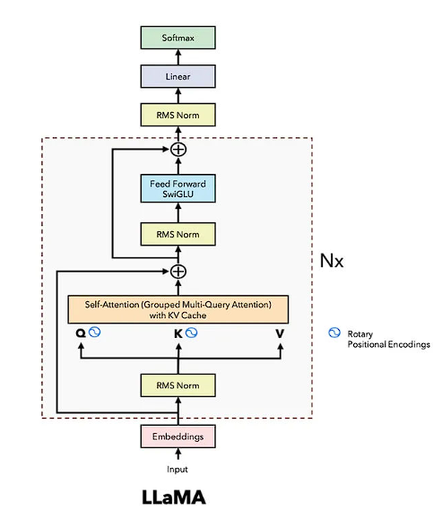

# Design-Doc: Исследовательский проект

/ основан на шаблоне команды [Reliable ML](https://github.com/IrinaGoloshchapova/ml_system_design_doc_ru/blob/main/ML_System_Design_Doc_Template.md) /

(Заполняется проектной командой: бизнес-заказчик, ML/инженеры, продуктовая команда)

## 1. Контекст проекта

### 1.1 Предмет исследования
Описание проблемы/вызова, который пытаемся решить (например: ускорение работы текущего решения, повышение метрик и качества).
- Исследование существующих моделей промптретриверов и выбор подходящей для работы с русским языком, улучшение метрик (p-MRR, nDCG, SICR), тестирование разных датасетов и выбор наиболее релевантного для дообучения.

Почему возникла идея это протестировать?
- на примере также адаптировать существующие модели под русский язык

Каковы критерии успеха с точки зрения исследования.
- Дообученная модель ретривера работает с запросами на русском языке, значения метрик p-MRR > 10+, nDCG > 40, при этом сохранятся базовые (Recall, MRR), модель устойчива к изменению формулировок инструкций

### 1.2 Ограничения и допущения

В случае дообучения модели существующего Promptriever, в ней будут те же ограничения:
- Качество метрик на английском языке может упасть после дообучения на русский язык
- Модель будет работать только на русском и английском языках

Если обучать энкодер с нуля (repllama):
- Модель будет понимать инструкции только на русском языке
- Настройка и подбор оптимальных гиперпараметров (ограничение времени и количества итераций полного обучения)

Предположения о данных, инфраструктуре, требованиях к безопасности, к нормативам.
- Для дообучения нужны будут датасеты с русским текстом, существуюет Rus MSMARCO, но он автоматически переведен с MSMARCO, поэтому могут быть ошибки и неточности. В других датасетах с русским языком нет изначально hard negatives, их придется формировать самостоятельно.
- Для дообучения потребуются облачные GPU и CPU, мощность будет ограничена допустимым числом ядер процессоров и времени для бесплатного обучения моделей. (На кагле это 30 часов GPU в неделю)
	

## 2. Архитектура решения

### 2.1 Общая схема
- Создается векторная структура данных для запросов и документов (FAISS / Qdrant)
- Основная модель это RepLLaMA на базе LLaMA-7B. Берется обученная версия и дообучается на русский язык. Через LLaMA прогоняются фрагменты текста, к выходу последнего слоя трансформера применя пулинг и нормализация, результат и будет итоговым эмбединг вектором, то же самое происходит с текстом запроса, затем эти 2 вектора сравниваются и приосходит итеррация обучения модели.     Используется классический decoder only transformer, так как он хорошо понимает общий контекст и частные связи слов в тексте. Это важно для для сохранения смыслов и связей в тексте при формировании эмбедингов (запросов с инструкциями и итоговых документов)
- Тестируется модель ретривера из статьи
- Собираются новые данные (документы) на русском языке, разбиваются на смысловые фрагменты очищаются от лишнего текста и распределяются по датасетам
- Происходит дообучение модели и затем заполнение векторной базы данных новыми векторами
- Затем на сформированной векторной базе данных считаем метрики, вносим корректировки и делаем выводы

### 2.2 Какие гипотезы тестируем?
- Модель из статьи после дообучения будет подходить для работы с документами на русском
- Дообученная модель будет показывать более высокую точность, чем изначальная модель промпт ретривера, в которую подается русская фраза переведенная на английский 
- Дообученная модель будет устойчива к изменению формулировок инструкций

## 3. Данные и качество знаний

Как много данных можно найти в теории? Какого рода эти данные (предметная область? либо если это general knowledge, то надо аргументировать разнообразие)

### 3.1 Сбор и предобработка данных
Источники документов/текста, форматы (PDF, HTML, TXT, базы данных).
- RU MS MARCO
- SberQuAD
- RuBQ

Шаги предобработки: токенизация, очистка, выделение сущностей, сегментация.
- Очистка, парсинг и разбивка текстов на смысловые фрагменты
- Генерация инструкций на русском языке с помощью LLM
- Создание hard negatives для обучения модели
- Сопостовление каждому запросу подходящий фрагмент или фрагменты текста (документы)

### 3.2 Метрики качества знаний
- Когда выбрали необходимые фрагменты, проверяем что они все на русском
- Отсеиваем слишком короткие фрагменты и слишком длинные (просто сортировка по длине)
- Для проверки разннобразия считаем количество различных тем и число фрагментов под каждую тему

## 4. Модель

### 4.1 Выбор модели
- Будем использовать модель из статьи bi-encoder retriever, испльзуем его, т. к. цель проекта изучиитть и протестировать именно его.
- Размер текста будет ограничен минмальным и максимальным размером фрагментов текста из обучающей выборки
- Скорость обучения ограничена числом ядер GPU и числом обучаемых параметров, в модели LLaMA их порядка 7B, скорость обработки запросов (промптов с инструкциями) также ограничена числом параметров и числом векторов в корпусе

### 4.2 Контроль качества выполнения
- p-MRR для исследования качества ответа на запрос с разными формулировками инструкции
- nDCG для имерения качества градации релевантных документов для конкретной инструкции
- SICR для ислледования реальной работы инструкции путем отслеживания позиции документа при данной и обратной инструкциях
- Для оценки лосса в процессе обучения используем формулу из статьи

### 4.3 Обучение/дообучение
- Собираем данные для дообучения, тестируем разные варианты (готовый ru ms marco либо сбор и фрагментация сырых данных) 
- Создаем инструкции для запросов с помощью LLM
- Генерируем порядка 30 instruction negatives под каждый запрос и 1 верный ответ.
- Создаем из полученных данных датасет и дообучаем на нем нашу модель

## 5. [OPTIONAL] Безопасность, соответствие и этика
	•	Обработка персональных данных, разрешения пользователей.
	•	Устранение вредоносного/нежелательного контента, фильтры.
	•	Прозрачность: уведомление о том, что это бот, логика сбора данных.
	•	Регулирования и нормативы (GDPR, внутренние политики).

## 6. [OPTIONAL] Бюджет и ресурсы
Скорее актуально для рабочего проекта и его запуска, но может быть полезно в рамках аргументации выбранного решения.

	•	Человеческие ресурсы: ML инженер, NLP инженер, DevOps, UX дизайнер, контент-менеджер.
	•	Технологические ресурсы: вычислительные ресурсы (GPU/CPU), лицензии, облачные сервисы.
	•	Примерные затраты (CAPEX, OPEX).
	•	ROI оценки: ожидаемое снижение затрат, ускорение ответа, рост удовлетворённости.

## 7. Приложения
Что-то, что стоит прописать в тексте работы во введении.
	•	Словарь терминов и аббревиатур.
	•	Ссылки на специфические документы: требования безопасности, регламент, UX-гайд, API-спецификации.
	•	Диаграммы, схемы, mock-up интерфейсов.
	•	Чек-лист готовности к запуску.
